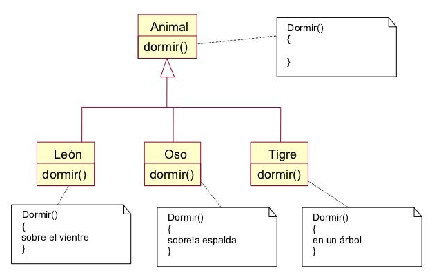

# Programación orientada a Objetos (POO)

---

La programación orientada a objetos se basa en cuatro conceptos fundamentales o “pilares”:

<br>

## Objetos

---


Los objetos en Java son **instancias** de una clase que tienen un estado, un comportamiento y una identidad las cuales definen ese tipo de entidad.

 - El estado de un objeto se define por sus **atributos**, que son variables que almacenan valores.
 - **El comportamiento de un objeto se define por sus métodos**, que son funciones que realizan acciones.
 - La identidad de un objeto se define por su referencia, que es un valor único que lo distingue de otros objetos.

Los objetos en Java se crean a partir de **clases**, que son plantillas que definen las características y el comportamiento común de un conjunto de objetos. Una clase se puede considerar como un tipo de dato definido por el usuario, que especifica los atributos y los métodos que tendrá cada objeto de esa clase. Para crear un objeto de una clase, se utiliza el operador **new**, que reserva memoria para el objeto y devuelve su referencia.

Los objetos en Java se comunican entre sí mediante el envío de mensajes, que son llamadas a los métodos de los objetos. Para enviar un mensaje a un objeto, se utiliza el operador punto (.), que permite acceder a los atributos y los métodos del objeto. Por ejemplo, si tenemos un objeto llamado persona de la clase Persona, podemos enviarle el mensaje getNombre() para obtener su nombre, escribiendo **persona.getNombre().**

Los objetos en Java tienen una relación de pertenencia con las clases, es decir, cada objeto pertenece a una clase y solo puede tener los atributos y los métodos definidos por esa clase. Sin embargo, las clases pueden tener una relación de herencia con otras clases, es decir, una clase puede heredar las características y el comportamiento de otra clase más general, y añadir o modificar algunos aspectos. La herencia permite reutilizar el código y facilita la organización jerárquica de las clases. Para indicar que una clase hereda de otra, se utiliza la palabra clave extends. Por ejemplo, si tenemos una clase Empleado que hereda de la clase Persona, podemos escribir:


<br>

## Objetos  

---


Las clases en Java son plantillas para la creación de objetos. Son un conjunto de planes que especifican cómo se construirán los objetos. Dentro de una clase se definen los datos y el código que actúa sobre esos datos12. Por ejemplo, podrías tener una clase Auto que tiene atributos como marca, modelo y color, y métodos como arrancar y parar. Cada Auto individual que crees sería un objeto de la clase Auto.


```java
public class Auto {
private String marca;
private String modelo;
private String color;

    public Auto(String marca, String modelo, String color) {
        this.marca = marca;
        this.modelo = modelo;
        this.color = color;
    }

    public void arrancar() {
        // código para arrancar el auto
    }

    public void parar() {
        // código para parar el auto
    }
}
```


- La abstracción es el proceso de simplificar la complejidad de los objetos del mundo real al modelar sus características relevantes y comportamientos en las clases y objetos. Por ejemplo, podrías tener una clase Animal que tiene atributos como nombre, edad y peso, y métodos como comer y dormir. Cada Animal individual que crees sería un objeto de la clase Animal

<br>


<br>

```java
public class Animal {
   private String nombre;
   private int edad;
   private double peso;

   public Animal(String nombre, int edad, double peso) {
      this.nombre = nombre;
      this.edad = edad;
      this.peso = peso;
   }

   public void comer() {
      // código para comer
   }

   public void dormir() {
      // código para dormir
   }
}

```

<br>

- El encapsulamiento es un mecanismo que oculta los detalles internos de un objeto y protege sus datos de modificaciones no autorizadas. En Java, esto se logra haciendo que los campos sean privados y proporcionando métodos getter y setter para cada campo. Por ejemplo, en la clase Animal anterior, los campos nombre, edad y peso son privados, por lo que no pueden ser accedidos o modificados directamente desde fuera de la clase. En su lugar, podrías proporcionar métodos getter y setter para permitir el acceso controlado a estos campos.

<br>


<br>

```java
public class Animal {
   private String nombre;
   private int edad;
   private double peso;

   public Animal(String nombre, int edad, double peso) {
      this.nombre = nombre;
      this.edad = edad;
      this.peso = peso;
   }

   public String getNombre() {
      return nombre;
   }

   public void setNombre(String nombre) {
      this.nombre = nombre;
   }

   // Métodos getter y setter para 'edad' y 'peso'...

   public void comer() {
      // código para comer
   }

   public void dormir() {
      // código para dormir
   }
}

```

<br>


- La herencia es un mecanismo que permite a una clase heredar atributos y métodos de otra clase. Por ejemplo, podrías tener una clase Perro que hereda de la clase Animal y agrega su propio método ladrar.

<br>


<br>

```java
public class Perro extends Animal {
   public Perro(String nombre, int edad, double peso) {
      super(nombre, edad, peso);
   }

   public void ladrar() {
      // código para ladrar
   }
}

```

<br>


- El polimorfismo se refiere a la capacidad de un objeto para tomar muchas formas. En Java, esto se logra a través de la herencia y la implementación de interfaces. Por ejemplo, si tienes una referencia a un objeto Animal, podría referirse a un objeto de cualquier subclase de Animal, como Perro o Gato. Esto permite tratar a diferentes tipos de objetos de manera uniforme.

<br>




<br>

```java
public interface Vehiculo {
   String matricula = "";
   float maxVel;
   void arrancar();
   void detener();
   default void claxon() {
      System.out.println("Sonando claxon");
   }
}


```

<br>

```java
public class Coche implements Vehiculo {
   public void arrancar() {
      System.out.println("arrancando motor...");
   }

   public void detener() {
      System.out.println("deteniendo motor...");
   }
}


```

<br>

En este ejemplo, Vehiculo es una interfaz que contiene dos campos (matricula y maxVel), dos métodos (arrancar y detener) y un método predeterminado (claxon). Para utilizar esta interfaz, una clase debe implementarla usando la palabra clave implements
<br>

<br>


## Formas de heredar

---

1. Superclases: Una superclase es una clase de la cual otras clases pueden heredar campos y métodos1. La herencia es un mecanismo que permite a una clase (llamada subclase) heredar campos y métodos de otra clase (llamada superclase). 

Las superclases se utilizan para proporcionar una estructura y comportamiento común a todas las subclases que heredan de ellas. Por ejemplo, si tienes una superclase Animal con un método comer(), todas las subclases como Perro y Gato heredarán este método.
   <br>
```java
public class Obra {
    private String titulo;
    private String autor;

    public Obra(String titulo, String autor) {
        this.titulo = titulo;
        this.autor = autor;
    }

    public void setTitulo(String titulo) {
        this.titulo = titulo;
    }

    public void setAutor(String autor) {
        this.autor = autor;
    }

    public String getAtributos() {
        return "El autor de \"" + titulo + "\" es " + autor + ".";
    }
}

public class Libro extends Obra {
    private int numeroDePaginas;

    public Libro(String titulo, String autor, int numeroDePaginas) {
        super(titulo, autor);
        this.numeroDePaginas = numeroDePaginas;
    }

    public String getAtributos() {
        return super.getAtributos() + "\nEl libro tiene " + numeroDePaginas + " páginas.";
    }
}


```

#### Caracterisiticas principales

- Una superclase es una clase de la cual otras clases pueden heredar campos y métodos.
- Los constructores no se heredan entre jerarquías de clases.
- Las superclases se utilizan para proporcionar una estructura y comportamiento común a todas las subclases que heredan de ellas.
- Una superclase puede tener métodos concretos (métodos con una implementación).
- Una clase puede heredar de una sola superclase.
- La herencia de una superclase establece un sistema de jerarquía de clases.
- Las subclases pueden añadir nuevos atributos y/o métodos.
- Las subclases pueden sobrescribir los métodos de la superclase.
- La clase Object es la superclase de todas las clases en Java.
- Las superclases promueven la reutilización de código.

<br>

2. Clases Abstractas: Una clase abstracta en Java es una clase que no se puede instanciar directamente y se utiliza como base para otras clases. Una clase abstracta puede contener métodos abstractos, que son métodos que no tienen una implementación y deben ser implementados por las clases que heredan de la clase abstracta. 

Las clases abstractas se utilizan para proporcionar una estructura común para las clases que heredan de ella. Por ejemplo, si tienes una clase abstracta FiguraGeometrica con métodos abstractos para calcular el área y el perímetro de una figura, puedes tener clases concretas como Circulo y Cuadrado que heredan de FiguraGeometrica y proporcionan implementaciones específicas para calcular el área y el perímetro

   <br>

```java
public abstract class Animal {
    protected String nombre;

    public Animal(String nombre) {
        this.nombre = nombre;
    }

    public abstract void hacerSonido();
}

public class Perro extends Animal {
    public Perro(String nombre) {
        super(nombre);
    }

    @Override
    public void hacerSonido() {
        System.out.println(nombre + " hace guau!");
    }
}

```
<br>

#### Caracterisiticas principales

- Una clase abstracta en Java es una clase que no se puede instanciar directamente.
- Una clase abstracta se utiliza como base para otras clases.
- Una clase abstracta puede contener métodos abstractos (métodos sin implementación).
- Una clase abstracta puede contener métodos concretos (métodos con implementación).
- Las clases abstractas se utilizan para proporcionar una estructura común para las clases que heredan de ella.
- Los métodos abstractos de una clase abstracta deben ser implementados por las subclases.
- Una clase abstracta puede tener variables y atributos normales.
- Una clase abstracta puede contener bloques estáticos.
- Una clase que contiene al menos un método abstracto debe ser declarada como clase abstracta.
- Las clases abstractas promueven la reutilización de código.

<br>

3. Interfaces: Una interfaz en Java es un tipo abstracto que contiene una colección de métodos y variables constantes. Las interfaces se utilizan para lograr la abstracción y el polimorfismo, y permiten a una clase heredar múltiples comportamientos.

Las interfaces se utilizan para unificar nombres de métodos pero seguir manteniendo comportamientos que no tienen nada que ver uno con el otro. Por ejemplo, si tomamos una clase Book y otra clase Invoice sería difícil establecer una relación jerárquica entre ellas (Ni Book es un tipo especial de Invoice ni viceversa). 

Sin embargo, es muy probable que ambas clases se beneficien de contar con un método print, aunque la forma específica de responder a esa llamada (Es decir, la forma de imprimir) será muy diferente para cada uno de ellos
   <br>

```java
public interface Pet {
    void play();
}

public class Dog implements Pet {
    public void play() {
        System.out.println("El perro está jugando");
    }
}


```
<br>

#### Caracterisiticas principales

- Una interfaz en Java es un tipo abstracto que contiene una colección de métodos y variables constantes.
- Las interfaces sólo pueden tener métodos abstractos (métodos sin implementación).
- Una clase puede implementar múltiples interfaces.
- Los métodos de una interfaz son implícitamente públicos.
- Una interfaz no puede contener métodos constructores.
- No se puede crear una instancia de una interfaz directamente.
- Una interfaz puede estar vacía, sin métodos o variables en ella.
- Todos los métodos de una interfaz deben tener el modificador de acceso público o predeterminado.
- Un método de interfaz no puede ser protegido o final.
- Las variables de interfaz son públicas, estáticas y finales por definición.

<br>


4. Interfaces Funcionales: Una interfaz funcional es un tipo especial de interfaz en Java que sólo tiene un método abstracto. Las interfaces funcionales se usan a menudo con lambdas, que son expresiones de código que se pueden tratar como valores59. Las interfaces funcionales se pueden utilizar para representar una operación única con una sola entrada y una sola salida

   <br>

```java
@FunctionalInterface
public interface Saludo {
    void decir(String mensaje);
}

public class SaludoEspañol implements Saludo {
    public void decir(String mensaje) {
        System.out.println("Hola, " + mensaje);
    }
}

public class Principal {
    public static void main(String[] args) {
        Saludo saludo = new SaludoEspañol();
        saludo.decir("mundo");
    }
}


```

<br>

#### Caracterisiticas principales

- Una interfaz funcional es una interfaz que tiene exactamente un método abstracto.
- Las interfaces funcionales se utilizan como objetivos para expresiones lambda y referencias de métodos.
- Las interfaces funcionales pueden utilizarse para representar una operación única con una sola entrada y una sola salida.
- Las interfaces funcionales pueden utilizarse como parámetros en lugar de mandar objetos o primitivos.
- Las interfaces funcionales promueven la programación funcional.
- Las interfaces funcionales pueden utilizarse para minimizar la escritura de código.
- Las interfaces funcionales pueden utilizarse para trabajar de una forma más legible.
- Las interfaces funcionales pueden utilizarse para reducir la complejidad del código.
- Las interfaces funcionales pueden utilizarse para generar un nuevo contenido prácticamente desde la nada.
- Las interfaces funcionales pueden utilizarse para agrupar métodos relacionados con cuerpos vacíos.

<br>

### Diferencias entre ellas

- Una superclase puede tener métodos concretos (métodos con una implementación), mientras que una interfaz sólo puede tener métodos abstractos (métodos sin implementación).
- Una clase puede heredar de una sola superclase, pero puede implementar múltiples interfaces.
- Una clase abstracta puede tener tanto métodos abstractos como métodos concretos, mientras que una interfaz sólo puede tener métodos abstractos.
- Una interfaz funcional es una interfaz que tiene exactamente un método abstracto

<br>

### Buenas prácticas al Abstraer
<br>
Promueve el uso de interfaces en lugar de clases abstractas para aquellos casos en los que se tenga pensado dar distintas implementaciones a un mismo método12.
El diseño de las aplicaciones debe ser orientado a las interfaces y no a la implementación13.
Concentrarse en crear buenas abstracciones

<br>

## Paquetes

---

<br>
Los paquetes en Java son contenedores de clases que permiten agrupar las distintas partes de un programa. Los paquetes son el mecanismo que usa Java para facilitar la modularidad del código. Un paquete puede contener una o más definiciones de interfaces y clases, distribuyéndose habitualmente como un archivo. Para utilizar los elementos de un paquete es necesario importar este en el módulo de código en curso, usando para ello la sentencia import

Paquetes en Java SE: Java SE (Standard Edition) proporciona una gran cantidad de paquetes que puedes utilizar en tus programas. Aquí te dejo algunos ejemplos:

- java.lang: Este paquete proporciona clases que son fundamentales para el diseño del lenguaje de programación Java.

- java.util: Este paquete contiene las colecciones de marcos, marcos de eventos legados, clases de fecha y hora, clases de internacionalización y varias clases de utilidad.

- java.io: Este paquete proporciona clases para la entrada y salida de datos a través de flujos de datos, serialización y el sistema de archivos.

- java.net: Este paquete proporciona clases para la implementación de aplicaciones de red.

- java.math: Este paquete proporciona clases para operaciones matemáticas para BigDecimal, BigInteger, etc.

