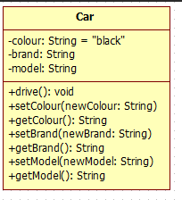
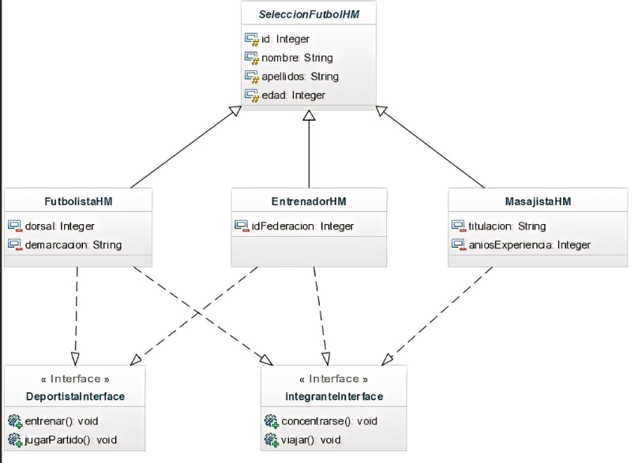
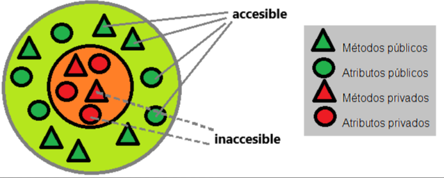
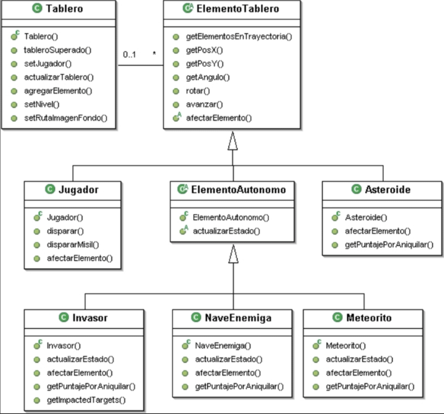

# Programación orientada a Objetos (POO)

---

La programación orientada a objetos se basa en cuatro conceptos fundamentales o “pilares”:

<br>

## Objetos

---


Los objetos en Java son **instancias** de una clase que tienen un estado, un comportamiento y una identidad las cuales definen ese tipo de entidad.

 - El estado de un objeto se define por sus **atributos**, que son variables que almacenan valores.
 - **El comportamiento de un objeto se define por sus métodos**, que son funciones que realizan acciones.
 - La identidad de un objeto se define por su referencia, que es un valor único que lo distingue de otros objetos.

Los objetos en Java se crean a partir de **clases**, que son plantillas que definen las características y el comportamiento común de un conjunto de objetos. Una clase se puede considerar como un tipo de dato definido por el usuario, que especifica los atributos y los métodos que tendrá cada objeto de esa clase. Para crear un objeto de una clase, se utiliza el operador **new**, que reserva memoria para el objeto y devuelve su referencia.

Los objetos en Java se comunican entre sí mediante el envío de mensajes, que son llamadas a los métodos de los objetos. Para enviar un mensaje a un objeto, se utiliza el operador punto (.), que permite acceder a los atributos y los métodos del objeto. Por ejemplo, si tenemos un objeto llamado persona de la clase Persona, podemos enviarle el mensaje getNombre() para obtener su nombre, escribiendo **persona.getNombre().**

Los objetos en Java tienen una relación de pertenencia con las clases, es decir, cada objeto pertenece a una clase y solo puede tener los atributos y los métodos definidos por esa clase. Sin embargo, las clases pueden tener una relación de herencia con otras clases, es decir, una clase puede heredar las características y el comportamiento de otra clase más general, y añadir o modificar algunos aspectos. La herencia permite reutilizar el código y facilita la organización jerárquica de las clases. Para indicar que una clase hereda de otra, se utiliza la palabra clave extends. Por ejemplo, si tenemos una clase Empleado que hereda de la clase Persona, podemos escribir:


<br>

## Objetos  

---


Las clases en Java son plantillas para la creación de objetos. Son un conjunto de planes que especifican cómo se construirán los objetos. Dentro de una clase se definen los datos y el código que actúa sobre esos datos12. Por ejemplo, podrías tener una clase Auto que tiene atributos como marca, modelo y color, y métodos como arrancar y parar. Cada Auto individual que crees sería un objeto de la clase Auto.



```java
public class Auto {
private String marca;
private String modelo;
private String color;

    public Auto(String marca, String modelo, String color) {
        this.marca = marca;
        this.modelo = modelo;
        this.color = color;
    }

    public void arrancar() {
        // código para arrancar el auto
    }

    public void parar() {
        // código para parar el auto
    }
}
```


- La abstracción es el proceso de simplificar la complejidad de los objetos del mundo real al modelar sus características relevantes y comportamientos en las clases y objetos. Por ejemplo, podrías tener una clase Animal que tiene atributos como nombre, edad y peso, y métodos como comer y dormir. Cada Animal individual que crees sería un objeto de la clase Animal

<br>




<br>

```java
public class Animal {
   private String nombre;
   private int edad;
   private double peso;

   public Animal(String nombre, int edad, double peso) {
      this.nombre = nombre;
      this.edad = edad;
      this.peso = peso;
   }

   public void comer() {
      // código para comer
   }

   public void dormir() {
      // código para dormir
   }
}

```

<br>

- El encapsulamiento es un mecanismo que oculta los detalles internos de un objeto y protege sus datos de modificaciones no autorizadas. En Java, esto se logra haciendo que los campos sean privados y proporcionando métodos getter y setter para cada campo. Por ejemplo, en la clase Animal anterior, los campos nombre, edad y peso son privados, por lo que no pueden ser accedidos o modificados directamente desde fuera de la clase. En su lugar, podrías proporcionar métodos getter y setter para permitir el acceso controlado a estos campos.

<br>



<br>

```java
public class Animal {
   private String nombre;
   private int edad;
   private double peso;

   public Animal(String nombre, int edad, double peso) {
      this.nombre = nombre;
      this.edad = edad;
      this.peso = peso;
   }

   public String getNombre() {
      return nombre;
   }

   public void setNombre(String nombre) {
      this.nombre = nombre;
   }

   // Métodos getter y setter para 'edad' y 'peso'...

   public void comer() {
      // código para comer
   }

   public void dormir() {
      // código para dormir
   }
}

```

<br>


- La herencia es un mecanismo que permite a una clase heredar atributos y métodos de otra clase. Por ejemplo, podrías tener una clase Perro que hereda de la clase Animal y agrega su propio método ladrar.

<br>



<br>

```java
public class Perro extends Animal {
   public Perro(String nombre, int edad, double peso) {
      super(nombre, edad, peso);
   }

   public void ladrar() {
      // código para ladrar
   }
}

```

<br>


- El polimorfismo se refiere a la capacidad de un objeto para tomar muchas formas. En Java, esto se logra a través de la herencia y la implementación de interfaces. Por ejemplo, si tienes una referencia a un objeto Animal, podría referirse a un objeto de cualquier subclase de Animal, como Perro o Gato. Esto permite tratar a diferentes tipos de objetos de manera uniforme.

<br>


<br>

```java
public interface Vehiculo {
   String matricula = "";
   float maxVel;
   void arrancar();
   void detener();
   default void claxon() {
      System.out.println("Sonando claxon");
   }
}


```

<br>

```java
public class Coche implements Vehiculo {
   public void arrancar() {
      System.out.println("arrancando motor...");
   }

   public void detener() {
      System.out.println("deteniendo motor...");
   }
}


```

<br>

En este ejemplo, Vehiculo es una interfaz que contiene dos campos (matricula y maxVel), dos métodos (arrancar y detener) y un método predeterminado (claxon). Para utilizar esta interfaz, una clase debe implementarla usando la palabra clave implements
<br>

<br>

## Paquetes

---

<br>
Los paquetes en Java son contenedores de clases que permiten agrupar las distintas partes de un programa1. Los paquetes son el mecanismo que usa Java para facilitar la modularidad del código2. Un paquete puede contener una o más definiciones de interfaces y clases, distribuyéndose habitualmente como un archivo2. Para utilizar los elementos de un paquete es necesario importar este en el módulo de código en curso, usando para ello la sentencia import

Paquetes en Java SE: Java SE (Standard Edition) proporciona una gran cantidad de paquetes que puedes utilizar en tus programas. Aquí te dejo algunos ejemplos:

- java.lang: Este paquete proporciona clases que son fundamentales para el diseño del lenguaje de programación Java.

- java.util: Este paquete contiene las colecciones de marcos, marcos de eventos legados, clases de fecha y hora, clases de internacionalización y varias clases de utilidad.

- java.io: Este paquete proporciona clases para la entrada y salida de datos a través de flujos de datos, serialización y el sistema de archivos.

- java.net: Este paquete proporciona clases para la implementación de aplicaciones de red.

- java.math: Este paquete proporciona clases para operaciones matemáticas para BigDecimal, BigInteger, etc.